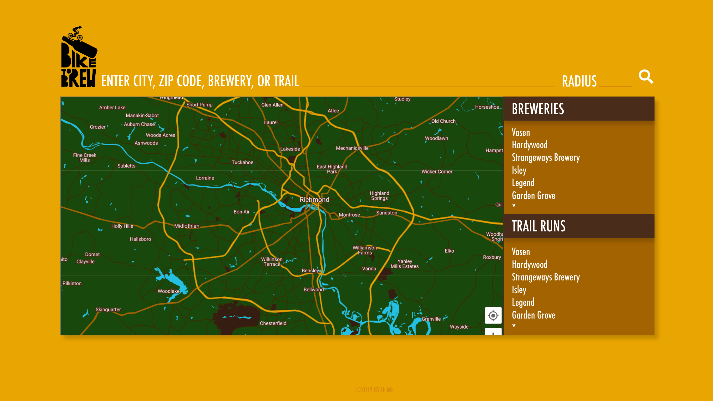

# Bike To Brew

Plan a tasty brew after your trail ride on Bike To Brew, search breweries and mountain biking trails together based on your chosen location, brewery, or trail.

=======================================================================================

**Team**
- Scott Zinski https://github.com/zkinsk
- Camille Hughes https://github.com/camille-the-eel
- Ryan Colosanti https://github.com/rjcolo28
- Marshall Dreiling https://github.com/mdreiling

=======================================================================================

**Technologies Used**
- HTML
- CSS
- Javascript
- jQuery
- AJAX
- APIs: 
    - Mountain Bike Project (https://www.mtbproject.com/)
    - Google Places
- Materialize CSS Framework
- Adobe Fonts

=======================================================================================

On page load, the user is presented with a geolocated map of their current location, populated with all mountain biking trails and breweries in a ten mile radius. These are shown on the map with their own respective icons, and on click, a pop up is shown, with the name of the selected brewery or trail and a "More Info" button. Upon clicking this button a modal with more information about said brewery or trail will be displayed for the user to browse.

Additionally, the right hand side of the populated map is a list of all nearby breweries, and a list of all nearby trails. Clicking on any of these list items will cause the map to jump to and zoom into the map icon of your selected choice, while also displaying the pop up with the name and "More Info" button.

Users have the option to search based on brewery, trail name, or location (in the form of city, city and state, latitude and longitude, or zip code). This will present the user with all trails and breweries within a ten mile radius of their search. Users also have the ability to change this radius to anywhere from one mile, up to fifty miles.

=======================================================================================

=======================================================================================

Wireframe Initial Sketches: https://xd.adobe.com/view/9981514b-9d59-41cc-62e7-0435917c9493-efb0/

Final Wireframe: 

